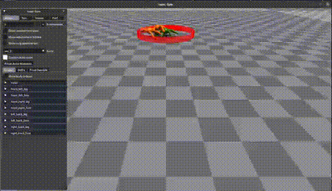
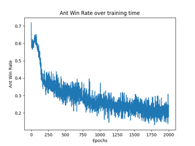
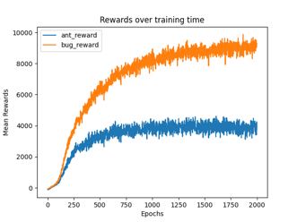

# Algorithm Innovations in "Small V.S. Big" Heterogeneous Multi-Agent Adversarial Settings(working)

## Installation

Please refer to the *Main* branch.

## Project Introduction

We have built a heterogeneous multi-agent(currently Ant and Bug, where Ant symbolizes "Small" and Bug symbolizes "Big") adversarial environment almost from scratch using Isaac Gym. Currently, we have defined two tasks and trained baseline performance using MAPPO.

## Task *Sumo* Description

There is a continuously shrinking boundary in the arena. An agent is considered out if its center of mass moves outside the boundary. The game ends when all agents of one team are out of bounds.

**Reward Design**

- Penalty for excessive joint activity
- Reward for approaching the center of the circle
- Penalty for being stationary
- Penalty for excessive actions (energy consumption)
- Penalty for falling over

## Training and Testing Commands

+ Training:

```bash
python train.py task=MA_Ant_Bug_Battle train=MA_Ant_Bug_BattlePPO headless=True max_iterations=2000 num_agents1=2 num_agents2=1 num_envs=2048 minibatch_size=8192
```

+ Testing:

```bash
python train.py task=MA_Ant_Bug_Battle train=MA_Ant_Bug_BattlePPO headless=False num_agents1=2 num_agents2=1 test=True checkpoint='path/to/your/checkpoint'
```

## Current Baseline Results

### Demo



### Ant Win Rate and Reward results through the training process

+ win_rate:



+ rewards:

